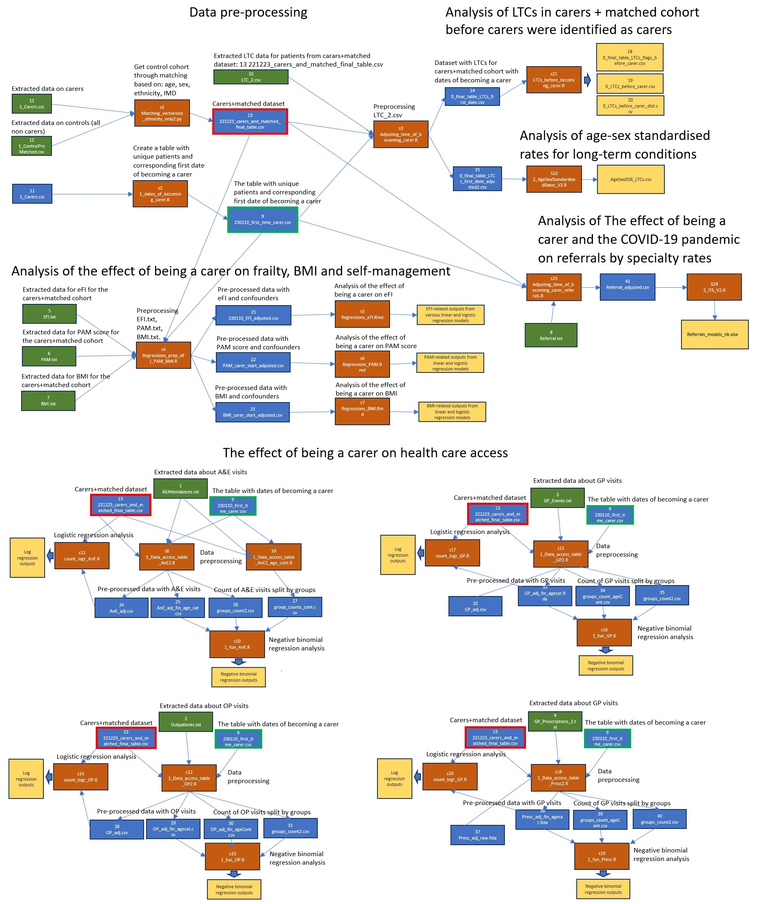

# Networked Data Lab: NDL North West London
## Impact of being an unpaid carer on health conditions and healthcare access in North West London

### Project Description
The Network Data Lab (NDL, https://www.health.org.uk/funding-and-partnerships/our-partnerships/the-networked-data-lab) is a pioneering collaborative network of analysts who use linked data, open analytics, and public and patient involvement to tackle the most pressing challenges in health and social care. The initiative is led by The Health Foundation working closely with five partner labs across the UK. The North West London Networked Data Lab (NWL NDL) is a partnership between Imperial College Health Partners (ICHP), North West London Health and Care Partnership, Imperial College’s School of Public Health, and the Institute of Global Health Innovation (IGHI).

The overarching aim of the NDL is to improve health and care services, and reduce health inequalities in the UK, with the current project specifically aiming to understand the needs, health issues and pathways to services of unpaid carers.

The aims of the study are to:
1. Explore the demographic profiles of unpaid carers as well as their geographical distribution in North West London
2. Estimate the effect of being a carer on health-related metrics and the risk of developing various long-term conditions
3. Analyse how the COVID-19 pandemic affects access of unpaid carers to healthcare services

To achieve these aims we extracted the healthcare data related to unpaid carers identified through a list of SNOMED codes in the Discover dataset. Discover data is the deidentified dataset which contains linked, coded primary care, secondary, acute, mental health, community health and social care records for over 2.5 million patients who live and are registered with a GP in North West London [4]. We also created a matched cohort based on gender, age, Index of Multiple Deprivation (IMD) and ethnicity to use as a control population for comparisons. The matched cohort contains professional carers, however, for brevity, in this study we refer to unpaid carers as carers and the matched population as non-carers.

See more detail about the methodology, results and discussion in "NDL Unpaid Carers report 2023.pdf" located in the folder "0_report". 

### About the repository
This repo is organised into the following folders:  
    1) 0_Report - contains the report with the results about unpaid carers   
    2) 1_Matching_and_preprocessing - contains the scripts for data pre-processing   
    3) 2_LTCs_before_becoming_a_carer - contains the scripts for the analysis of LTCs of carers before they were identified as carers   
    4) 3_Health_metrics - containts the scripts for analysis of the effect of being a carer on frailty, BMI and self-management   
    5) 4_Healthcare_access - containts the scripts for analysis of the effect of being a carer on health care access   

The relationships between the scripts, intemediate and final output files are shown here

Please see also ScriptsConnections.xlsx

### Data sources
This analysis utilised the Discover dataset (https://www.discover-now.co.uk/), which is accessible via the Discover-NOW Health Data Research Hub for Real World Evidence through their data scientist specialists and IG committee-approved analysts, hosted by Imperial College Health Partners.

### Cohort derivation
All data used in this analysis was extracted from the Discover dataset.
Unpaid carers were defined using the SNOMED codes recently approved by The Health Foundation (SNOMED codes used to define Unpaid carers.xlsx).
We included data from February 2015 to May 2022, considering the period from February 2015 to February 2020 as the pre-COVID-19 pandemic period and data from March 2020 to May 2022 to reflect the COVID-19 pandemic.
Unpaid carers cohort: we included all patients in NWL aged over 18 from February 2015 to May 2022 who had at least one of the specified SNOMED codes for unpaid carers during the study period and did not have any of these codes within two years before the start of study (wash-out period).
Control cohort: we also created a control cohort by matching each carer with up to five patients who did not have unpaid carer codes within the study period. Matching was based on gender, age, IMD decile and ethnic category. The matching was done using a set of consecutive rules (for each rule when more than five control patients were matched, five were selected randomly).
1) First, matching was done to get up to five control patients using gender, age, IMD decile and ethnic category
2) If none were matched based on the first approach, then matching was performed based on gender, age, IMD decile
3) If none were matched based on the second approach, then matching was performed based on gender, age, ethnic category and IMD decile, allowing IMD decile value to differ by one
Patients with missing data in the fields for age, ethnicity or IMD decile were removed from the cohort (<5% for carers cohort).

### Requirements
The Python and R packages and their versions used in the study are listed in installed_packages.csv

The work was done using:  
Python 3.9.5      
&nbsp;&nbsp;&nbsp;&nbsp;&nbsp;&nbsp;   Packages:  
&nbsp;&nbsp;&nbsp;&nbsp;&nbsp;&nbsp;&nbsp;&nbsp;&nbsp;&nbsp;&nbsp;&nbsp;    * Pandas 1.3.4  

R version 4.2.1   
&nbsp;&nbsp;&nbsp;&nbsp;&nbsp;&nbsp;   Packages:   
&nbsp;&nbsp;&nbsp;&nbsp;&nbsp;&nbsp;&nbsp;&nbsp;&nbsp;&nbsp;&nbsp;&nbsp;    * AER 1.2-10   
&nbsp;&nbsp;&nbsp;&nbsp;&nbsp;&nbsp;&nbsp;&nbsp;&nbsp;&nbsp;&nbsp;&nbsp;    * arm 1.13-1   
&nbsp;&nbsp;&nbsp;&nbsp;&nbsp;&nbsp;&nbsp;&nbsp;&nbsp;&nbsp;&nbsp;&nbsp;    * car 3.1-0   
&nbsp;&nbsp;&nbsp;&nbsp;&nbsp;&nbsp;&nbsp;&nbsp;&nbsp;&nbsp;&nbsp;&nbsp;    * caret 6.0-92  
&nbsp;&nbsp;&nbsp;&nbsp;&nbsp;&nbsp;&nbsp;&nbsp;&nbsp;&nbsp;&nbsp;&nbsp;    * collections 0.3.5   
&nbsp;&nbsp;&nbsp;&nbsp;&nbsp;&nbsp;&nbsp;&nbsp;&nbsp;&nbsp;&nbsp;&nbsp;    * dplyr 1.0.9   
&nbsp;&nbsp;&nbsp;&nbsp;&nbsp;&nbsp;&nbsp;&nbsp;&nbsp;&nbsp;&nbsp;&nbsp;    * fitdistrplus 1.1-8   
&nbsp;&nbsp;&nbsp;&nbsp;&nbsp;&nbsp;&nbsp;&nbsp;&nbsp;&nbsp;&nbsp;&nbsp;    * jtools 2.2.1   
&nbsp;&nbsp;&nbsp;&nbsp;&nbsp;&nbsp;&nbsp;&nbsp;&nbsp;&nbsp;&nbsp;&nbsp;    * magrittr 2.0.3   
&nbsp;&nbsp;&nbsp;&nbsp;&nbsp;&nbsp;&nbsp;&nbsp;&nbsp;&nbsp;&nbsp;&nbsp;    * MASS 7.3-58   
&nbsp;&nbsp;&nbsp;&nbsp;&nbsp;&nbsp;&nbsp;&nbsp;&nbsp;&nbsp;&nbsp;&nbsp;    * plotROC 2.3.0   
&nbsp;&nbsp;&nbsp;&nbsp;&nbsp;&nbsp;&nbsp;&nbsp;&nbsp;&nbsp;&nbsp;&nbsp;    * pROC 1.18.0   
&nbsp;&nbsp;&nbsp;&nbsp;&nbsp;&nbsp;&nbsp;&nbsp;&nbsp;&nbsp;&nbsp;&nbsp;    * predtools 0.0.2   
&nbsp;&nbsp;&nbsp;&nbsp;&nbsp;&nbsp;&nbsp;&nbsp;&nbsp;&nbsp;&nbsp;&nbsp;    * rcompanion 2.4.18   
&nbsp;&nbsp;&nbsp;&nbsp;&nbsp;&nbsp;&nbsp;&nbsp;&nbsp;&nbsp;&nbsp;&nbsp;    * tibble 3.1.7   
&nbsp;&nbsp;&nbsp;&nbsp;&nbsp;&nbsp;&nbsp;&nbsp;&nbsp;&nbsp;&nbsp;&nbsp;    * tidyr 1.2.0   
&nbsp;&nbsp;&nbsp;&nbsp;&nbsp;&nbsp;&nbsp;&nbsp;&nbsp;&nbsp;&nbsp;&nbsp;    * tidyverse 1.3.2   
&nbsp;&nbsp;&nbsp;&nbsp;&nbsp;&nbsp;&nbsp;&nbsp;&nbsp;&nbsp;&nbsp;&nbsp;    * splines 4.2.1   
&nbsp;&nbsp;&nbsp;&nbsp;&nbsp;&nbsp;&nbsp;&nbsp;&nbsp;&nbsp;&nbsp;&nbsp;    * stringr 1.4.0   
    
    

### Authors 
Evgeniy Galimov: Data preprocessing, matching cohorts, long-term conditions distributions before becoming carers, the effect of being a carer on on frailty, BMI and self-management, and health care access (folders: 1_Matching_and_preprocessing, 2_LTCs_before_becoming_a_carer, 3_Health_metrics, 4_Healthcare_access)

The code developed by other coauthors will be added later:  
Roberto Fernandez Crespo - Analysis of age-sex standardised rates for long-term conditions and the effect of being a carer and the COVID-19 pandemic on referrals by specialty rates (folders: 5_COVIDeffect_on_referrals and 6_Age-sex_standardised_rate)  
Moulesh Shah - Data extraction (Code is not loaded yet)  
Sandeep Parshar - Descriptive analysis (Code is not loaded yet)  

### License
This project is licensed under the [MIT License](https://opensource.org/licenses/MIT).
